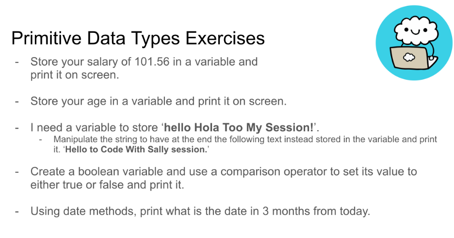
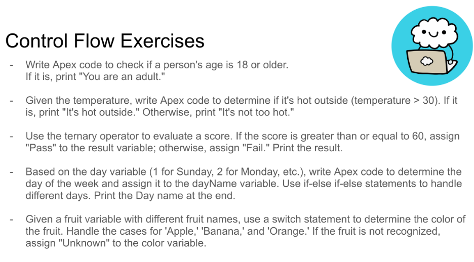
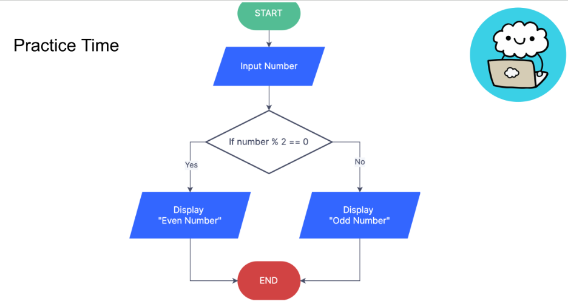
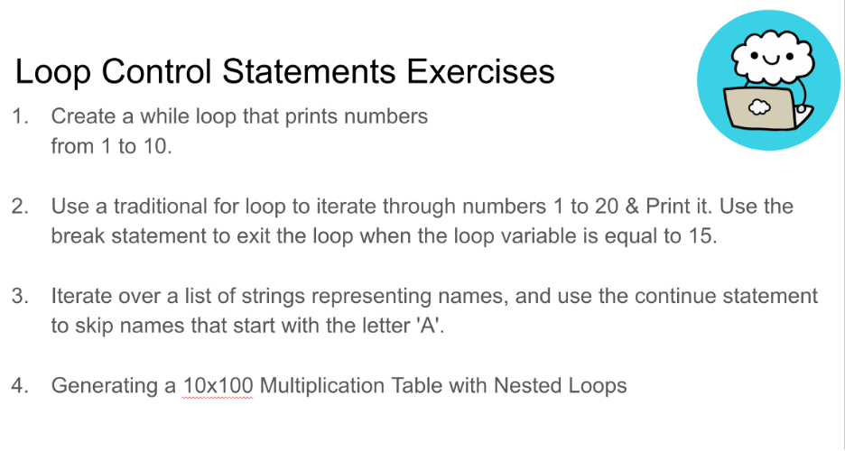

# Week 1 – Apex Fundamentals (Variables, Logic, Loops, Collections)

📅 **To be completed between: Nov 18 → Nov 25**

This week focuses on the fundamentals of Apex:
- Variables  
- Primitive data types and their methods
- Conditional logic (if/else, else-if, ternary, switch)  
- Loops (while, do-while, for, for-each, break/continue)  
- Intro to Collections (Lists + Sets)

---

# 🎬 Videos to Watch

# Week 1 – Video List

Below are the videos assigned for Week 1:

1. Salesforce Apex Basics | Kickoff Session  
   https://www.youtube.com/watch?v=1dA2yCYygO4&list=PLeevJTFuNoITnI2Tol-iY4dYSh2JVPd3J

2. Variables & Primitive Data Types – Part 1  
   https://www.youtube.com/watch?v=ixx8AUy9p5Y&index=2

3. Variables & Primitive Data Types – Part 2  
   https://www.youtube.com/watch?v=W5EEpKVN5Sc&index=3

4. Primitive Data Types HW & Intro to Conditional Logic  
   https://www.youtube.com/watch?v=JTWYhUqTbkc&index=4

5. Deep Dive into Conditional Statements – Part 2  
   https://www.youtube.com/watch?v=MwkiVInpY9s&index=5

6. Logical Operators & Ternary Operator – Part 3  
   https://www.youtube.com/watch?v=0tGMWAvzm9Q&index=6

7. Switch Statements & Conditional Logic – Part 4  
   https://www.youtube.com/watch?v=WkOTTyA5YhU&index=7

8. Exploring While & Do-While Loops – Part 1  
   https://www.youtube.com/watch?v=Jyms6KKrv6Y&index=8

9. Mastering For, For Each & SOQL Loops – Part 2  
   https://www.youtube.com/watch?v=mn1LS4NvjLk&index=9

10. Mastering Break & Continue + Loop Comparison – Part 3  
    https://www.youtube.com/watch?v=aWkkXryj3F8&index=10

11. Mastering Lists & Essential List Methods – Part 1  
    https://www.youtube.com/watch?v=2-nde-DExSE&index=11

12. Navigating Collections – Mastering Sets – Part 2  
    https://www.youtube.com/watch?v=f4LI66OmRbA&index=12

---

# ✋ Hands-On Homework (Part 1)

🔹 **Do everything I do in the videos**  
Recreate all examples in:
- Variables  
- Primitive data types  
- If/else  
- Ternary  
- Switch  
- For/while/do-while loops  
- Collection basics  
Experiment using Salesforce documentation (try new methods!).

---

# ✋ Hands-On Homework (Part 2 – Exercises)

## 1️⃣ Primitive Data Types Exercises  

## 2️⃣ Conditional Flow Exercises  

## 3️⃣ Flowchart → Code  
Convert the even/odd flowchart into:  
- if/else version  
- ternary operator version 

## 4️⃣ Loop Control Statements  

---

# 📤 How to Submit Homework
Submit your code using a **public GitHub Gist** and paste the link in Slack if you want me to review it.

---

# ⭐ Optional Extra Challenges (Recommended)

These challenges help you combine everything you learned this week:
**variables → primitive data types → conditional logic → loops → lists.**

All exercises can be completed in the **Developer Console**, printing your results using `System.debug()`.

---

## 🔥 Challenge 1 — Student Grader

Create a small Apex program that:

1. Creates an integer variable called `score` and assigns it any value between 0 and 100.
2. Validates the score using **if/else**:
   - If the score is less than 0 or greater than 100 → print `"Invalid score"`.
3. If the score is valid, determine the letter grade using **if/else** logic:
   - A = 90 and above  
   - B = 80–89  
   - C = 70–79  
   - D = 60–69  
   - F = below 60
4. After completing the if/else version, write a **second version** using a **ternary operator** to assign the grade.
5. Print the final grade using `System.debug()`.

**Goal:** Practice validation logic, multi-branch decisions, and ternary syntax.

---

## 🔥 Challenge 2 — Mini Calculator

Create a simple calculator program that:

1. Creates two number variables (any integer values).
2. Creates a `String` variable called `operator` with one of the following values: `+`, `-`, `*`, `/`.
3. Uses **any conditional structure you prefer** (if/else or switch) to perform the calculation based on the operator.
4. Prints the result using `System.debug()`.
5. If the operator is not supported, prints `"Invalid operator"`.

**Goal:** Practice choosing the right conditional structure and applying operators to variables.

---

## 🔥 Challenge 3 — List Cleaning

Given the list: List names = new List{`Amir`,`Sara`,`Ahmed`,`Lina`,`Ali`,`Ken`};

Write a program that:

1. Creates a **new empty list** to store the cleaned names.
2. Loops through the original list (choose **any** loop type you think is appropriate).
3. Adds each name to the new list **only if the name does not start with the letter 'A'**.
4. Prints the cleaned list using `System.debug()`.

**Goal:** Practice choosing the right loop, filtering with conditionals, and working with lists.

---

## 🎯 Why These Challenges?

These optional exercises help reinforce:

- Declaring and using primitive data types  
- Writing conditional logic (`if`, `else if`, `else`)  
- Using the ternary operator  
- Using `switch` statements  
- Writing different types of loops  
- Working with lists  
- Printing and debugging results  

You should now feel more confident mixing Apex fundamentals together to solve real problems!

---

You got this! 🚀  