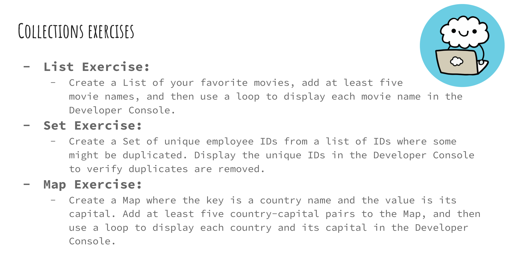
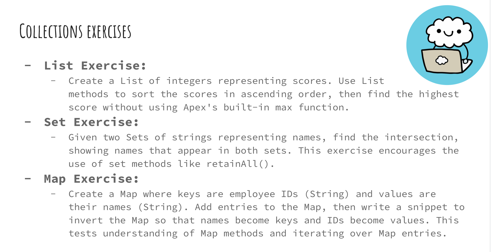
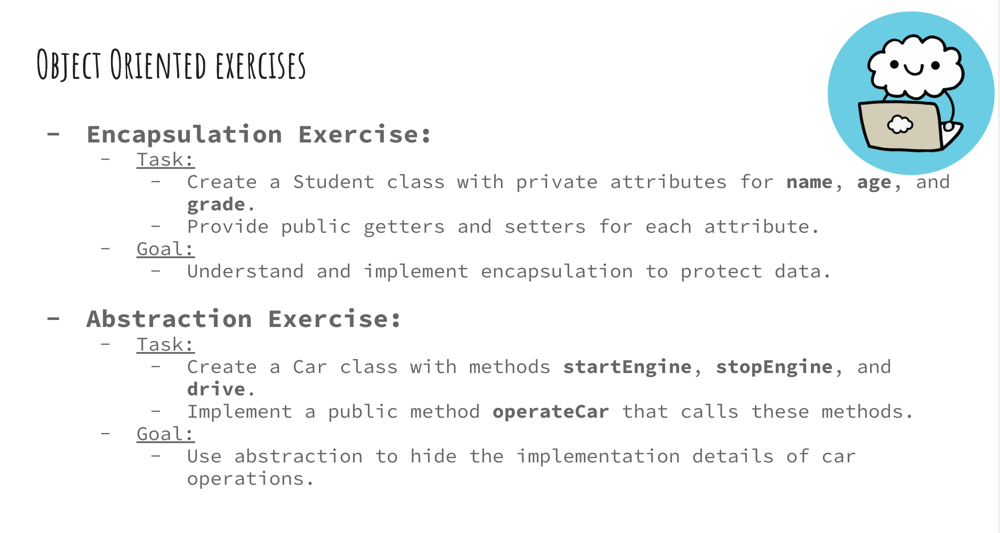
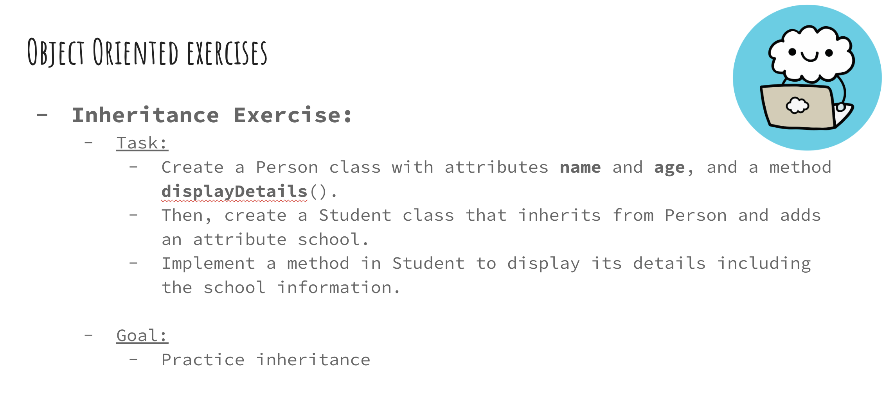
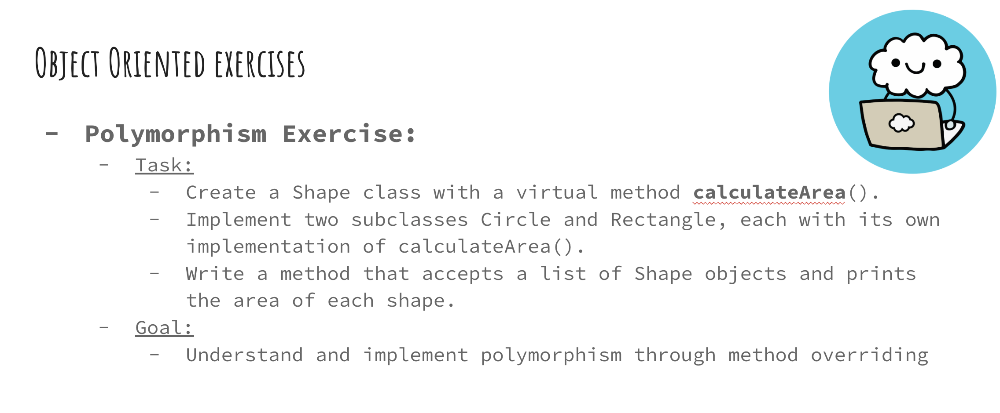
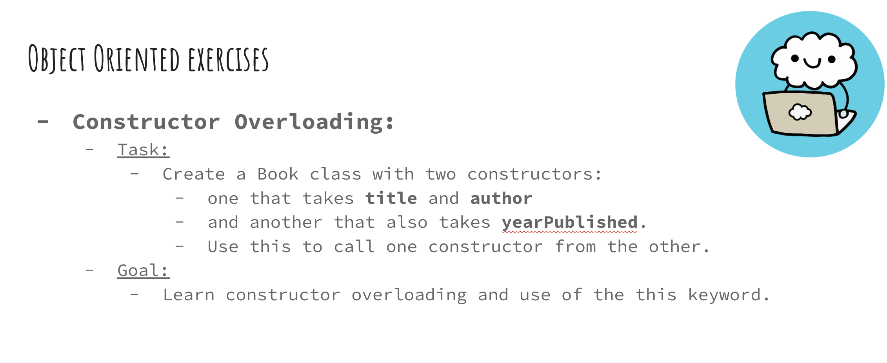
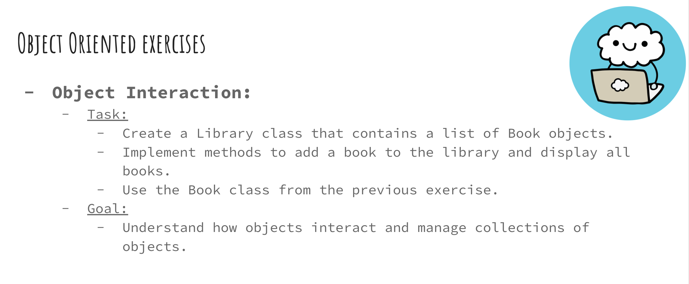
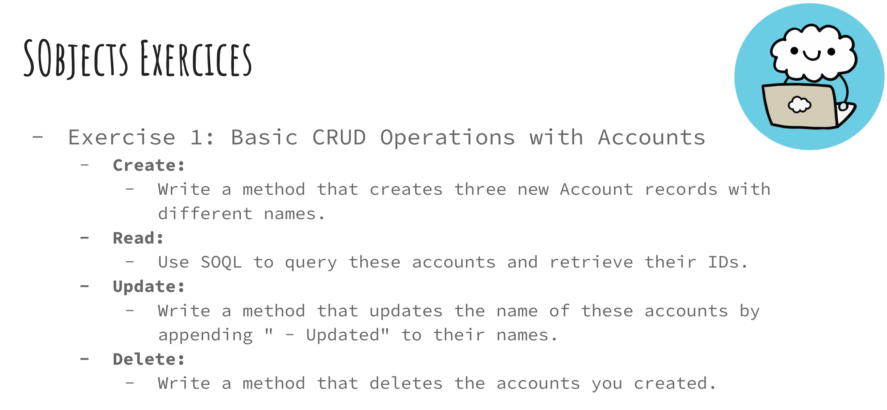
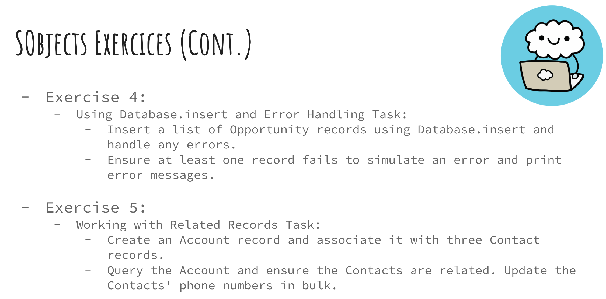
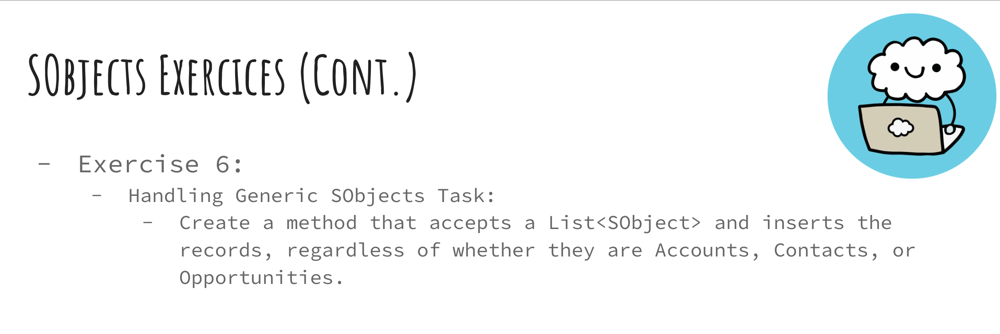

# Week 2 – Collections, Object-Oriented Programming & sObjects

📅 **To be completed between: Nov 25 → Dec 2**

Welcome to Week 2!  
This week we go deeper into Apex with advanced Collections, Object-Oriented Programming (OOP), and Salesforce Objects (sObjects).

You will learn:

- Maps & advanced collection methods  
- Object-oriented fundamentals (classes, objects, constructors)  
- Encapsulation, abstraction, inheritance & polymorphism  
- Working with sObjects (CRUD, relationships, bulk inserts, generic sObjects)

---

# 🎬 Videos Must Watch

Below are the required videos for Week 2:

1. Navigating Collections – Mastering Maps – Part 3  
   https://youtu.be/n8fqbukK1Fo?si=NRsG4xwEBms6Hp1p  

2. Collections Comparison & Homework – Part 4  
   https://youtu.be/xqStLbzO9qc?si=hCvHXp3CRD3XdFgs  

3. Introduction to OOP – Part 1  
   https://youtu.be/tbiXL85-6e0?si=FWnUqDgYAAlzkjN8  

4. Methods & Constructors – Part 2  
   https://youtu.be/XrlsaDUO0lI?si=JF7yVLt2i1bMOhP3  

5. Static Methods & this Keyword – Part 3  
   https://youtu.be/PlWIUnIL4AY?si=zVpOMz4onF_9Jghr  

6. this Keyword & Encapsulation – Part 4  
   https://youtu.be/TtFH9HT72Rc?si=Kma67iHMRSHnGj-Q  

7. Encapsulation & Abstraction – Part 5  
   https://youtu.be/ciLr99fXavI?si=ocwGZhQmD2QwsaZl  

8. Inheritance & Polymorphism – Part 6  
   https://youtu.be/vdq2QC3ruEU?si=9X2WuC-x-KsfJPwj  

9. OOP Q&A & Homework – Part 7  
   https://youtu.be/zKssBqAk_DM?si=qluRloMXksrYBmfl  

10. Introduction to sObjects – Part 1  
   https://youtu.be/VJH4IVd39xE?si=ZTeVkoJeGy-eK-ej  

11. Bulk Inserts & Related Records – Part 2  
   https://youtu.be/Y_rwHUThYqY?si=am9PgEnayEbqYIWy  

12. Generic sObjects & Casting – Part 3  
   https://youtu.be/aKeVNijSjjI?si=nHMi4bjccEFqJy1C  

13. Best Practices for Working with sObjects – Part 4  
   https://youtu.be/XSLlyY0xK0w?si=QvVPbCC3LayPQgYr  

---

# ✋ Hands-On Homework (Part 1)

### **Do Everything I Do in the Videos**

Recreate every example shown in videos 13–25, including:

- Map creation, iteration & methods  
- OOP examples (classes, methods, constructors)  
- `this` keyword & static behavior  
- Encapsulation & abstraction examples  
- Inheritance & polymorphism  
- CRUD on sObjects  
- Related records  
- Bulk operations  
- Generic sObjects  

Practice, type everything yourself, and explore documentation methods.

---

# ✋ Hands-On Homework (Part 2)  
## Collections Exercises

### List, Set & Map Exercises  
  

---

# ✋ Hands-On Homework (Part 3)  
## Object-Oriented Programming Exercises

### Encapsulation & Abstraction  

### Inheritance  

### Polymorphism  

### Constructor Overloading  

### Object Interaction  

---

# ✋ Hands-On Homework (Part 4)  
## sObjects Exercises

### Basic CRUD & Object Tasks  

### Error Handling, Related Records  

### Generic sObjects  

---

# 📤 How to Submit Homework
Submit your code using a **GitHub Gist** and paste the link in Slack if you want me to review it.

---

# 🌟 Optional Extra Challenges (Recommended)  
# 🌟🌟🌟 Camp Apex Collaboration 🌟🌟🌟

This week, **Code With Sally** is excited to introduce additional hands-on coding challenges in collaboration with **Camp Apex**!  

A huge thank you to **Saman Attar** for supporting the Africa Ohana Cohort 🙌

---

### 🔥 Choose **any 3–5 challenges** to complete from each category (From Camp Apex):

1. **Variables**: https://www.campapex.org/practice/variables  
2. **Conditionals**: https://www.campapex.org/practice/conditionals  
3. **Loops**: https://www.campapex.org/practice/loops  

---

# 🔹 Camp Apex – Week 2 Submission Details

For Camp Apex challenges, please follow the **username naming convention**:

👉 **Your Camp Apex username must start with:**  
`africaOhana1_`

This ensures that your activity is tracked correctly.

You **do NOT** need to submit Camp Apex challenge solutions** to me or to Saman on Gist.  
✔️ Camp Apex automatically tracks and marks completion  
✔️ Saman will run progress reports based on your completed challenges  

During our **final live session**, we will recognize the **most active participant** — the student who completed the highest number of assigned Camp Apex challenges in the African Ohana Development Sprint.

Let’s make Africa Ohana Cohort 1 shine! 🌍🔥

---

# 🎯 Why These Exercises Matter

By completing Week 2, you will be able to:

- Work confidently with Lists, Sets & Maps  
- Write classes, constructors, methods & static logic  
- Apply encapsulation, abstraction, inheritance & polymorphism  
- Understand how objects interact  
- Work with sObjects and relationships  
- Perform CRUD, bulk operations & safe inserts  
- Handle errors using `Database.insert`  
- Use generic sObjects  

These are **core skills** for every Salesforce developer.

---

You got this! 🚀  
If you get stuck, ask questions in Slack — we learn together, and **no one gets left behind**.