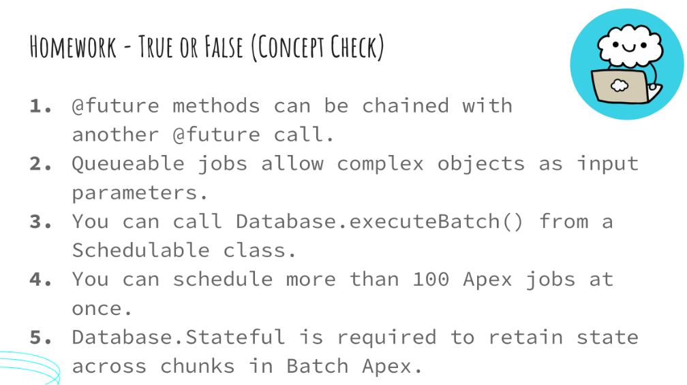
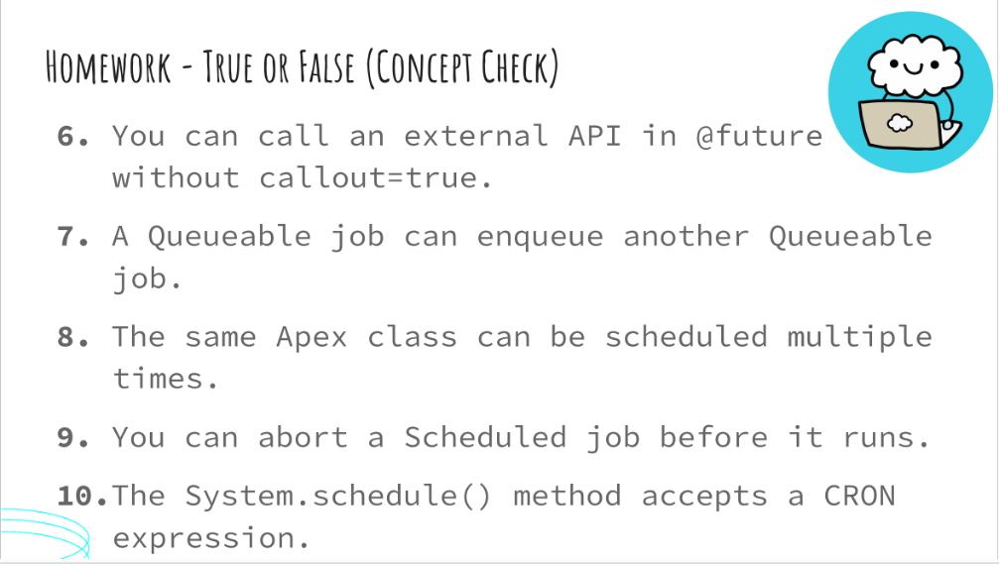
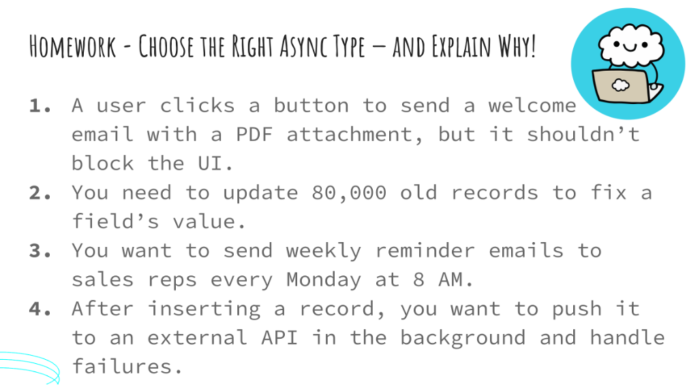
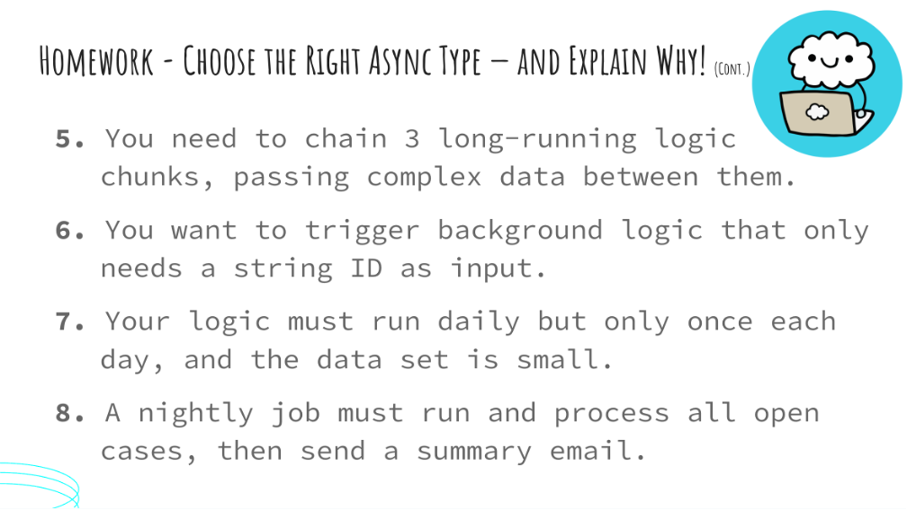
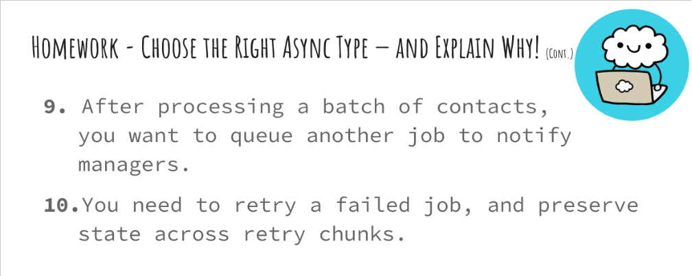

# Homework: Asynchronous Apex

This homework is designed to help you review the different types of Asynchronous Apex in Salesforce. Make sure to read each statement and question carefully.

---

## 📌 Part 1: True or False

For each of the following statements, decide whether it is **True** or **False**. Refer to your session notes or Salesforce documentation if needed.

  

---

## 📌 Part 2: Choose the Right Async Type

Review each scenario and choose the **most appropriate Asynchronous Apex type** to use. Your options may include:
- Future Methods
- Queueable Apex
- Batch Apex
- Scheduled Apex

  
  

---

Happy coding! 🚀
